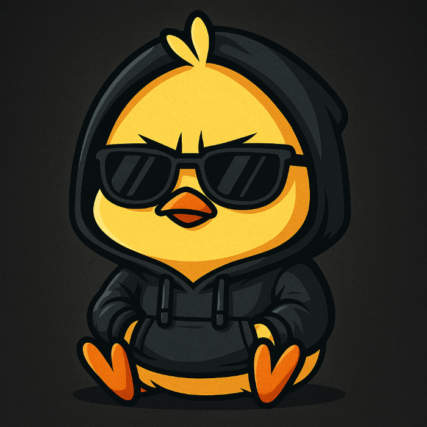

  

<h1 align="center">👋 Hi, I’m Mr. Hex</h1>

  🧑‍💻 Ethical Hacker • 🐍 Python Developer • 🛡️ Cybersecurity Instructor 
  👨‍🏫 Helping learners build real-world labs for ethical hacking and red-team practice.

---

### 🧠 About Me

- 🔐 Founder of **CryptoLock Ransomware POC Lab**
- 👨‍🏫 Teaching [Udemy Course on Ethical Ransomware Simulations](https://www.udemy.com/course/ethical-hacking-build-ransomware-with-control-center-poc/)
- 🎓 Focused on **cybersecurity education**, red-team training, and malware analysis.

---

### 🚀 Projects & Labs

| Project              | Description                                                  |
|----------------------|--------------------------------------------------------------|
| 🔐 **[Ransomware-POC](https://github.com/hexa-bin/Ransomware-POC)** | Full lab: Python + PHP ransomware simulation with GUI + C2 |
| 🔎 StegoTools        | (Coming Soon) CLI toolset for steganography training         |
| 🛡️ ThreatLab         | (Coming Soon) Curated red-team simulation playbooks          |

---

### 💡 What I Teach

- Python scripting for hacking & automation  
- Ransomware behavior simulation (educational use)  
- API exploitation and C2 channel building  
- Ethical lab deployment and threat emulation  

---

### 📦 Latest Course

> 🚨 **[Build Ethical Ransomware with Control Center (Udemy)](https://www.udemy.com/course/ethical-hacking-build-ransomware-with-control-center-poc/)**  
> Learn to build safe simulations using Python, PHP, GUI logic, and EXE wrangling.  
> 🎓 390+ Students • ⭐ 4.8 ★ • Certificate Included

---

### 🧭 Connect With Me

- GitHub: [@hexa-bin](https://github.com/hexa-bin)
- 💬 Discord: Coming Soon
- 💼 LinkedIn: (optional link)
- 🌐 Portfolio: Coming Soon

---

  
  
  

